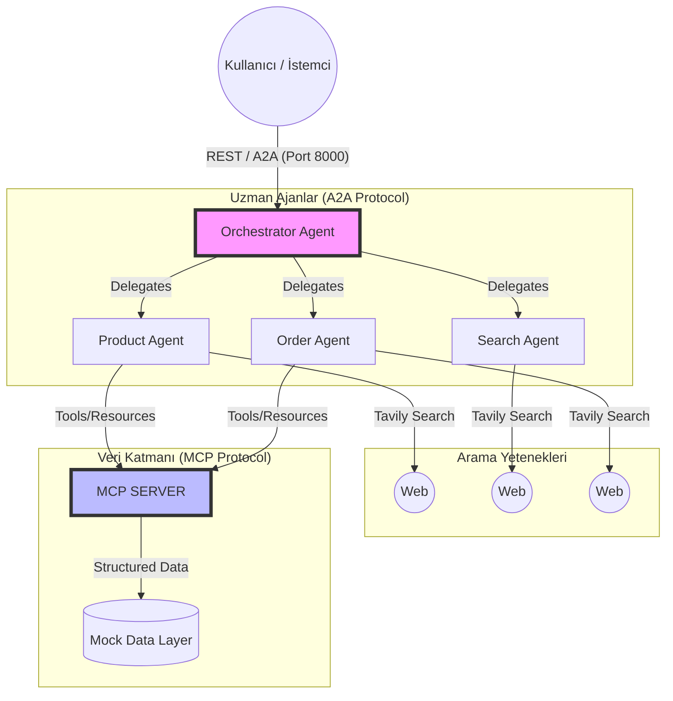
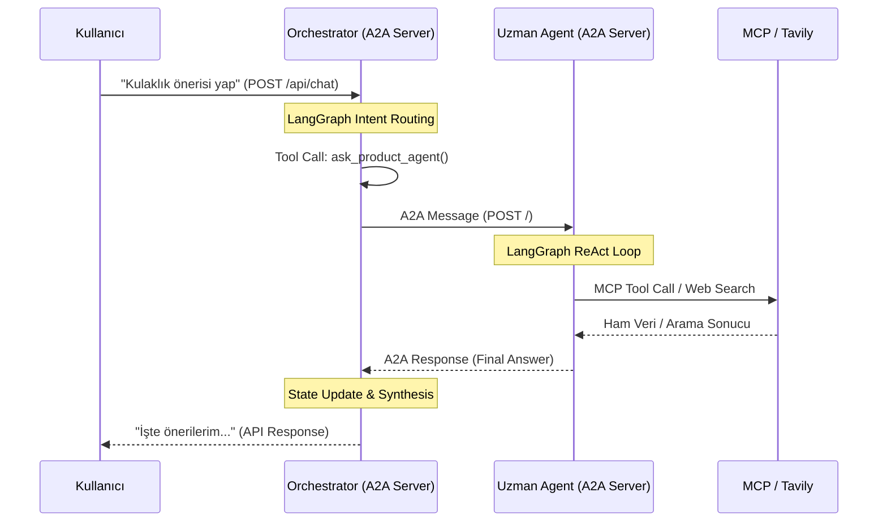

# 🛒 E-Commerce AI Multi-Agent System

[](https://github.com/hilalTortumluoglu/ecommerce-a2a-agents/actions)
[](https://python.org)
[](https://github.com/a2aproject/a2a-python)
[](https://github.com/langchain-ai/langgraph)
[](LICENSE)

## 📖 Makale ve Sunum
Bu projenin arkasındaki vizyonu, A2A ve MCP protokollerinin nasıl kullanıldığını anlatan Medium makalesini buradan okuyabilirsiniz:
👉 **[E-Ticaretin Geleceği: Multi-Agent AI Sistemleri ve MCP](https://medium.com/@hilal.tortumluoglu/e-ticaret-ajanlar%C4%B1nda-a2a-protokol%C3%BC-teknik-mimari-implementasyon-ve-vaka-analizi-106d942eb968)**


>  E-ticaret müşterileri tek bir konuşmada birden fazla sorun yaşar — "Bu ürün uygun mu?", "Siparişim nerede?", "Başka yerde daha ucuz mu?". Bunları ayrı ayrı yönetmek yerine bu sistem, **akıllı bir orkestratör** aracılığıyla her soruyu doğru uzman ajana yönlendirerek tek bir seamless deneyim sunar.

## 📐 Mimari



### Teknoloji Stack

| Katman | Teknoloji | Amaç |
|--------|-----------|------|
| **Agent İletişimi** | [A2A SDK v0.3.22](https://github.com/a2aproject/a2a-python) | Agent-to-Agent Protocol |
| **Agent Mantığı** | [LangGraph](https://github.com/langchain-ai/langgraph) | ReAct döngüsü, state yönetimi |
| **LLM** | [OpenAI](https://openai.com) | Dil modeli |
| **Tool Protokolü** | [MCP](https://modelcontextprotocol.io) | Araç standardizasyonu |
| **Web Search** | [Tavily](https://tavily.com) | Gerçek zamanlı web araması |
| **Web Framework** | Starlette + Uvicorn | Async HTTP sunucu |
| **Konteynerizasyon** | Docker + Docker Compose | Production deployment |
| **Loglama** | structlog | JSON structured logging |

## 🎯 Özellikler

### Product Agent (Port 8006)
- 🔍 Ürün arama ve filtreleme (kategori, fiyat, puan, stok)
- 📦 Detaylı ürün bilgisi (özellikler, yorumlar, indirimler)
- 💡 Akıllı ürün önerileri
- 🌐 Tavily ile web'de ürün araması
- 📊 Stok ve fiyat kontrolü

### Order Agent (Port 8005)
- 📍 Gerçek zamanlı sipariş takibi
- 🚚 Kargo durum bilgisi (tracking events)
- ❌ Sipariş iptali ve iade yönetimi
- 👤 Müşteri profili ve sadakat puanları
- 📋 Sipariş geçmişi

### Search Agent (Port 8004)
- 🌐 Tavily ile gelişmiş web araması
- 💰 Fiyat karşılaştırması (Trendyol, Hepsiburada, Amazon TR)
- ⭐ Kullanıcı yorumu ve uzman inceleme araması
- 📈 Trend ürün analizi

### Orchestrator (Port 8000)
- 🎯 Akıllı intent routing
- 🔄 Multi-agent koordinasyonu
- 🌐 REST API gateway (`/api/chat`)
- 🔍 A2A Agent Card discovery

### MCP Server (Port 8090)
- 📚 10 e-ticaret aracı
  - `search_products`, `get_product_details`, `get_products_by_category`, `check_product_availability`
  - `get_order_status`, `get_customer_orders`, `get_customer_profile`, `cancel_order`
  - `get_recommendations`, `search_customers` (Yeni!)
- 🛍️ 10 mock ürün (gerçekçi Türkçe verilerle)
- 📦 4 mock sipariş
- 👥 3 mock müşteri
- 🔌 SSE transport

## 🚀 Hızlı Başlangıç

### Gereksinimler

- Docker 24+ ve Docker Compose v2
- OpenAI API Key ([buradan al](https://openai.com))
- Tavily API Key ([buradan al](https://tavily.com)) _(opsiyonel, web search için)_

### 1. Repo'yu Klonla

```bash
git clone https://github.com/yourusername/ecommerce-a2a-agents.git
cd ecommerce-a2a-agents
```

### 2. Ortam Değişkenlerini Ayarla

```bash
cp .env.example .env
```

`.env` dosyasını düzenle:

```env
OPENAI_API_KEY=sk-ant-your-key-here
TAVILY_API_KEY=tvly-your-key-here   # Opsiyonel
LLM_MODEL=gpt-4o-mini-2024-07-184
LANGCHAIN_TRACING_V2=true
LANGCHAIN_API_KEY=lsv2_your-key-here
LANGCHAIN_PROJECT=project-name

```

### 3. Docker ile Başlat

```bash
docker compose up --build
```

İlk build birkaç dakika sürebilir. Tüm servisler ayağa kalktığında:

```
✅ MCP Server      → http://localhost:8090/health
✅ Product Agent   → http://localhost:8006/.well-known/agent.json
✅ Order Agent     → http://localhost:8005/.well-known/agent.json
✅ Search Agent    → http://localhost:8004/.well-known/agent.json
✅ Orchestrator    → http://localhost:8000/health
```

### 4. Test Et

```bash
# REST API ile hızlı test
curl -X POST http://localhost:8000/api/chat \
  -H "Content-Type: application/json" \
  -d '{"message": "Bana iyi bir kulaklık önerir misin?"}'
```

## 💬 Kullanım Örnekleri

### REST API

```bash
# Ürün önerisi
curl -X POST http://localhost:8000/api/chat \
  -H "Content-Type: application/json" \
  -d '{"message": "500 TL altı elektronik ürün önerir misin?", "session_id": "user-123"}'

# Sipariş takibi
curl -X POST http://localhost:8000/api/chat \
  -H "Content-Type: application/json" \
  -d '{"message": "ord-001 siparişim nerede?", "session_id": "user-123"}'

# Fiyat karşılaştırma
curl -X POST http://localhost:8000/api/chat \
  -H "Content-Type: application/json" \
  -d '{"message": "Sony WH-1000XM5 piyasa fiyatı ne kadar?", "session_id": "user-123"}'

# Sipariş iptali
curl -X POST http://localhost:8000/api/chat \
  -H "Content-Type: application/json" \
  -d '{"message": "ord-003 siparişimi iptal etmek istiyorum", "session_id": "user-123"}'

# İsim bazlı akıllı sorgu (A2A + MCP Search)
curl -X POST http://localhost:8000/api/chat \
  -H "Content-Type: application/json" \
  -d '{"message": "Zeynep Kaya son siparişim ne durumda?", "session_id": "user-123"}'
```

### A2A Protocol (Python Client)

```python
import asyncio
import uuid
import httpx
from a2a.client import A2AClient
from a2a.types import MessageSendParams, SendMessageRequest
from a2a.utils import new_agent_text_message

async def main():
    async with httpx.AsyncClient() as http_client:
        # Orchestrator'ı keşfet (Agent Card'dan)
        client = A2AClient(
            httpx_client = http_client, 
            url = "http://localhost:8000"
        )
        
        # Mesaj gönder
        request = SendMessageRequest(
            id=str(uuid.uuid4()), 
            params=MessageSendParams(
                message=new_agent_text_message("Kulaklık önerir misin?"),
            )
        )
        response = await client.send_message(request)
        print(response)

asyncio.run(main())
```

### Demo Client

```bash
# Bağımlılıkları yükle
pip install httpx rich a2a-sdk

# Tüm testleri çalıştır
python scripts/test_client.py

# Belirli bir agent'ı test et
python scripts/test_client.py --agent product
python scripts/test_client.py --agent order

# İnteraktif sohbet modu
python scripts/test_client.py --chat

# Sağlık kontrolü
python scripts/test_client.py --health
```

## 📁 Proje Yapısı

```
ecommerce-a2a-agents/
│
├── agents/
│   ├── orchestrator/
│   │   ├── agent.py       # LangGraph orkestratör (A2A client olarak)
│   │   ├── executor.py    # A2A AgentExecutor implementasyonu
│   │   └── server.py      # A2A Server + REST API gateway
│   ├── product_agent/
│   │   ├── agent.py       # LangGraph ürün agenti
│   │   ├── executor.py    # A2A AgentExecutor
│   │   └── server.py      # A2A Server
│   ├── order_agent/
│   │   ├── agent.py       # LangGraph sipariş agenti
│   │   ├── executor.py    # A2A AgentExecutor
│   │   └── server.py      # A2A Server
│   └── search_agent/
│       ├── agent.py       # LangGraph arama agenti (Tavily)
│       ├── executor.py    # A2A AgentExecutor
│       └── server.py      # A2A Server
│
├── mcp_server/
│   └── server.py          # MCP server (9 e-ticaret aracı)
│
├── utils/
│   ├── config.py          # Merkezi konfigürasyon (pydantic-settings)
│   ├── logging.py         # Structured logging (structlog)
│   └── models.py          # Domain modelleri (Product, Order, Customer)
│
├── data/
│   └── mock_data.py       # Mock veri katmanı (10 ürün, 4 sipariş, 3 müşteri)
│
├── tests/
│   └── test_client.py     # Demo A2A istemcisi
│
├── Dockerfile             # Multi-stage Docker build
├── docker-compose.yml     # Production Docker Compose
├── pyproject.toml         # Python proje konfigürasyonu
└── .env.example           # Örnek ortam değişkenleri
```

## 🏗️ A2A Protocol Akışı



Her agent:
1. `/.well-known/agent.json` — Agent Card (yetenek keşfi)
2. `POST /` — JSON-RPC mesaj gönderimi
3. `AgentExecutor.execute()` — LangGraph iş mantığı
4. `TaskUpdater` — Durum güncellemeleri (submitted → working → completed)

## 🔧 Geliştirme (Local)

### Virtual Environment

```bash
python -m venv .venv
source .venv/bin/activate  # Windows: .venv\Scripts\activate

pip install -e ".[dev]"
```

### Servisleri Ayrı Ayrı Çalıştır

```bash
# Terminal 1: MCP Server
python -m mcp_server.server

# Terminal 2: Product Agent
python -m agents.product_agent.server

# Terminal 3: Order Agent
python -m agents.order_agent.server

# Terminal 4: Search Agent
python -m agents.search_agent.server

# Terminal 5: Orchestrator
python -m agents.orchestrator.server
```

### Linting

```bash
ruff check .
ruff format .
```

## 🌐 API Referansı

### Orchestrator REST API

| Endpoint | Method | Açıklama |
|----------|--------|---------|
| `/health` | GET | Servis sağlık durumu |
| `/api/chat` | POST | Chat endpoint |
| `/api/agents` | GET | Mevcut agentların listesi |
| `/.well-known/agent.json` | GET | A2A Agent Card |

### POST /api/chat

```json
{
  "message": "Kulaklık önerir misin?",
  "session_id": "optional-session-id"
}
```

Yanıt:
```json
{
  "response": "Evet! Katalogumuzda şu anda...",
  "session_id": "optional-session-id"
}
```