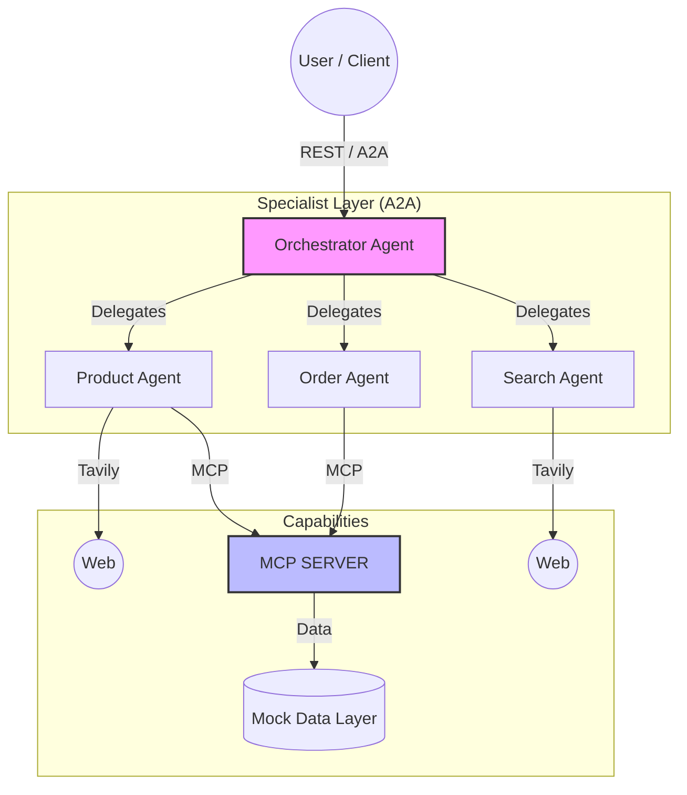
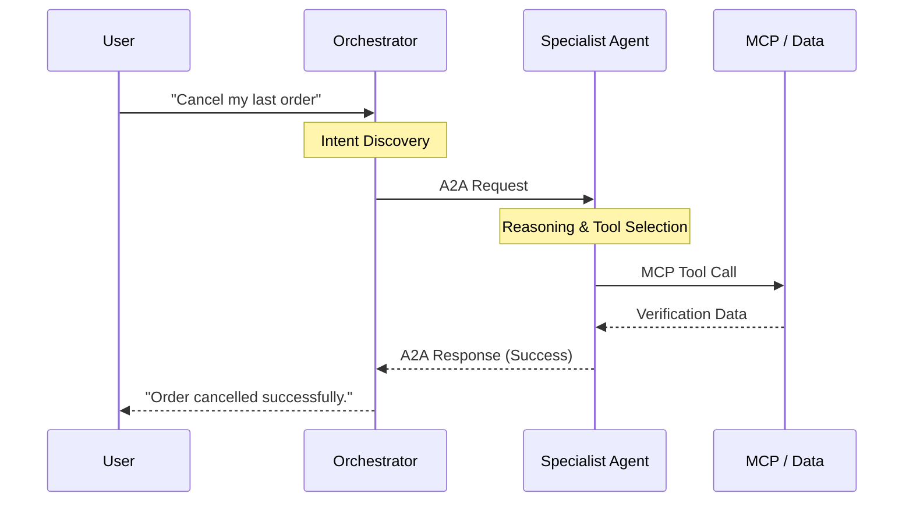

# 🛒 E-Commerce AI Multi-Agent System (A2A + MCP)

[](https://python.org)
[](https://github.com/a2aproject/a2a-python)
[](https://github.com/langchain-ai/langgraph)
[](LICENSE)

An advanced e-commerce assistant built on the **Agent-to-Agent (A2A)** and **Model Context Protocol (MCP)**. This system coordinates specialized agents to handle complex customer journeys—from product research to order management—in a single, unified conversation.

---

## 📖 Deep Dive
Read the full technical analysis and vision on Medium:
👉 **[The Future of E-Commerce: Multi-Agent AI Systems & MCP](https://medium.com/@hilal.tortumluoglu/e-ticaret-ajanlar%C4%B1nda-a2a-protokol%C3%BC-teknik-mimari-implementasyon-ve-vaka-analizi-106d942eb968)**

---

## 📐 Architecture Overview

The system uses an **Intelligent Orchestrator** to delegate high-level user intents to domain-specific specialists over the A2A protocol.



<details>
<summary><b>🛠️ Technology Stack</b></summary>

| Component | Technology | Description |
|-----------|------------|-------------|
| **Protocol** | [A2A SDK v0.3.22](https://github.com/a2aproject/a2a-python) | Secure Agent-to-Agent communication. |
| **Logic** | [LangGraph](https://github.com/langchain-ai/langgraph) | State-aware ReAct loops for complex reasoning. |
| **Tooling** | [MCP](https://modelcontextprotocol.io) | Standardized database and tool access. |
| **Research** | [Tavily AI](https://tavily.com) | Real-time web search and competitive analysis. |
| **Runtime** | Docker & Starlette | High-performance async microservices. |

</details>

---

## 🎯 Key Capabilities

### 🧠 Intelligent Orchestration
Dynamically routes requests based on agent capabilities discovered through **Agent Cards**. No hardcoded logic—pure intent discovery.

### 🔌 Model Context Protocol (MCP) Integration
A unified server providing 10 specialized e-commerce tools, allowing agents to perform multi-hop reasoning (e.g., *Customer Name → Email → Order History → Inventory Check*).

### ⚡ Feature Highlights
- **Product Agent**: Cross-category search, intelligent recommendations, and stock validation.
- **Order Agent**: Real-time tracking, structured cancellation flows, and loyalty management.
- **Search Agent**: Market price comparison across major platforms (Amazon, Trendyol, etc.).

---

## 🚀 Getting Started

### 1. Configure Environment
```bash
cp .env.example .env
# Essential: OPENAI_API_KEY, TAVILY_API_KEY
```

### 2. Launch Services
```bash
docker compose up --build
```

### 3. Verify Deployment
| Service | API Endpoint |
|---------|--------------|
| **Gateway** | `http://localhost:8000/api/chat` |
| **Agent Card** | `http://localhost:8000/.well-known/agent.json` |
| **Health** | `http://localhost:8090/health` |

---

## 💬 Usage & Patterns

### Common Scenarios

#### **Identity-Aware Complex Query**
Resolve customer identity from name and check status in one go.
```bash
curl -X POST http://localhost:8000/api/chat \
  -H "Content-Type: application/json" \
  -d '{"message": "What is the status of Zeynep Kaya'\''s last order?"}'
```

#### **Cross-Agent Coordination**
Compare a catalog item with market trends.
```bash
curl -X POST http://localhost:8000/api/chat \
  -d '{"message": "Compare the price of item Sony XM5 with other Turkish retailers."}'
```

<details>
<summary><b>🔍 Advanced Protocol Flow (A2A Sequence)</b></summary>


</details>

---

## 📁 Repository Structure

<details>
<summary><b>Expand to view directory details</b></summary>

```
.
├── agents/             # Specialist & Orchestrator agent implementations
├── mcp_server/         # Standardized MCP server (10 E-commerce tools)
├── data/               # Mock dataset (Products, Orders, Customers)
├── utils/              # Shared logging, config, and models
├── tests/              # Integration and performance test suites
└── docker-compose.yml  # Microservices orchestration
```
</details>

---

## 🔧 Local Development

```bash
# Install for local testing
pip install -e ".[dev]"

# Individual service run
python -m agents.orchestrator.server
```

---
*Built with ❤️ for the future of decentralized AI agent ecosystems.*